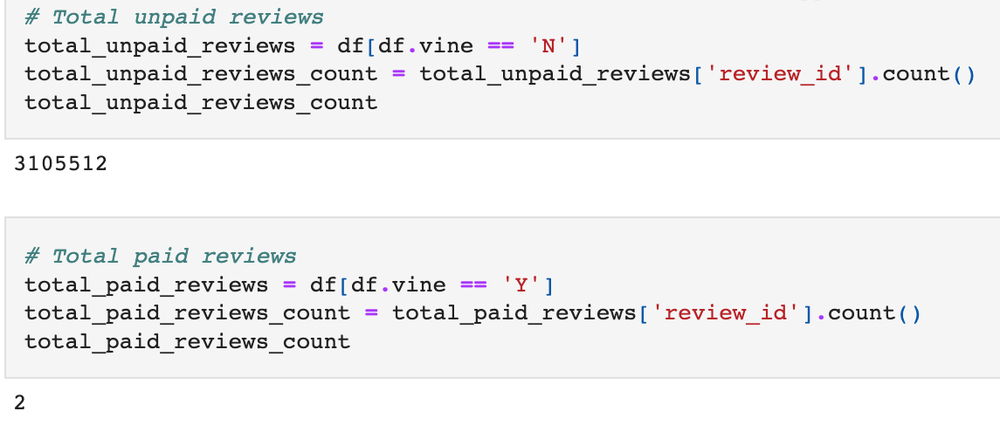
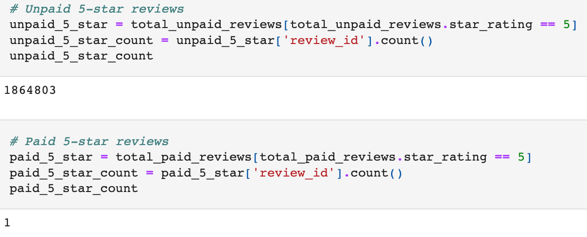
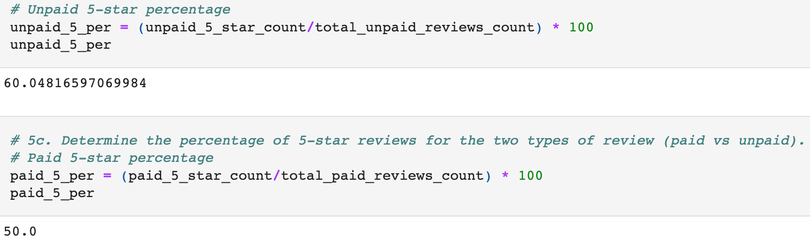

# Amazon Vine Analysis

## Overview of Project

### Purpose

The purpose of this project was to analyze Amazon book reviews written by members of the paid Amazon Vine program. The Amazon Vine program is a service that allows manufacturers and publishers to receive reviews for their products. Some companies pay a small fee to Amazon and provide products to Amazon Vine members, who are then required to publish a review.

dataset used: https://s3.amazonaws.com/amazon-reviews-pds/tsv/amazon_reviews_us_Books_v1_02.tsv.gz

## Results by Vine and non-Vine Members

- Total Book Reviews
    - **Vine**: 2
    - **non-Vine**: 3,105,512

    

- Total 5-Star Book Reviews
    - **Vine**: 1
    - **non-Vine**: 1,864,803

    

- Percentage of 5-Star Book Reviews
    - **Vine**: ~ 60.0%
    - **non-Vine**: 50.0%

    

## Summary

Given that the number of total reviews from the Vine program is less than one percent, there is no positivity bias for book reviews. An additional analysis we could do to further check is to look at review body content to see if the terms "Vine" or "Vine program" can be found within the reviews.